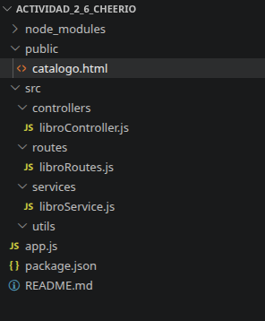
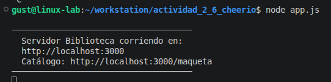
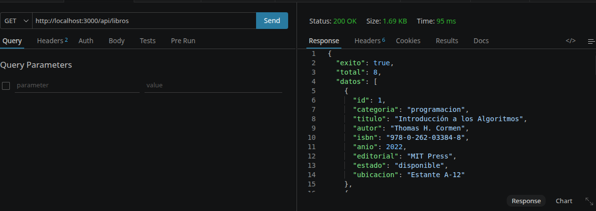
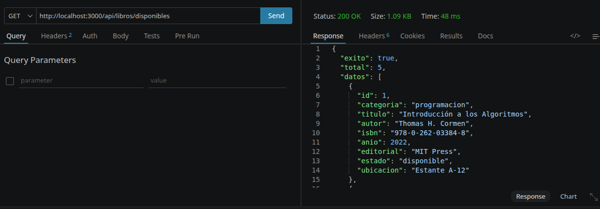
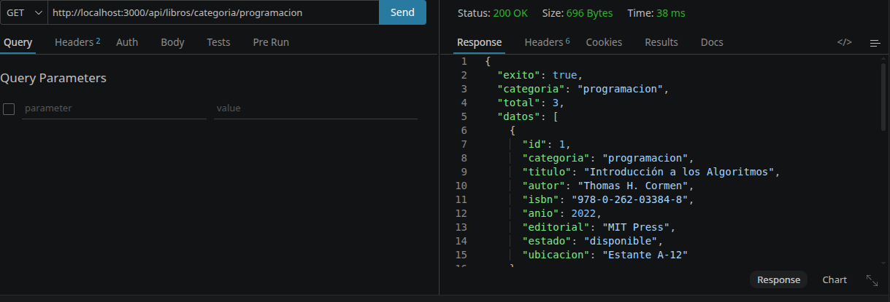
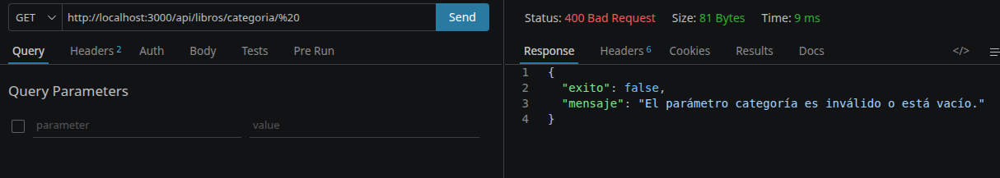
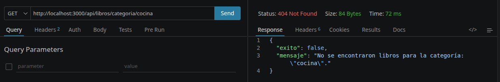

# API Biblioteca Universitaria - Documentación Técnica

Bienvenido a la documentación oficial de la **API de Scraping** para el catálogo de la biblioteca. Este proyecto transforma un catálogo legacy en HTML en una plataforma de datos estructurada.

## 📂 Estructura del Proyecto

El desarrollo se basa en una **Arquitectura por Capas**, lo que permite separar la lógica de negocio, el manejo de rutas y la extracción de datos.

*Captura de la organización del código fuente en VS Code.*

---

## 🚀 Servidor en Ejecución

El servidor ha sido configurado para proporcionar retroalimentación clara en la consola al iniciar, facilitando las pruebas locales.

*Evidencia del servidor Node.js corriendo correctamente.*

---

## 🛠️ Endpoints y Pruebas de Funcionamiento

Se han implementado y validado los tres endpoints requeridos por el Problema 2, garantizando la entrega de datos estructurados en formato JSON

### 1. Catálogo Completo

**Endpoint:** `GET /api/libros`  

Retorna la totalidad de los libros parseados desde el archivo legacy. Se extraen 9 campos por cada objeto.

### 2. Filtro de Disponibilidad

**Endpoint:** `GET /api/libros/disponibles` 

Este endpoint filtra el catálogo en tiempo real para retornar exclusivamente los ejemplares cuyo estado es "Disponible".

### 3. Filtro por Categoría

**Endpoint:** `GET /api/libros/categoria/:categoria`

Permite la búsqueda segmentada.

---

## 🛡️ Manejo de Errores Controlado

Se implementó una matriz de errores basada en códigos de estado HTTP para garantizar una comunicación clara con el cliente.

#### Error 400 - Bad Request (Dato Inválido)
Se valida que el parámetro de categoría no sea nulo ni contenga únicamente espacios en blanco.

* **Prueba:** `/api/libros/categoria/%20`

#### Error 404 - Not Found (Sin Resultados)
Se activa cuando la categoría es sintácticamente correcta pero no existen libros asociados en el catálogo.

* **Prueba:** `/api/libros/categoria/cocina`

#### Error 500 - Internal Server Error
Manejo de excepciones mediante bloques `try/catch`. Se dispara si ocurre una falla crítica, como la ausencia del archivo de base de datos HTML.

* **Mensaje:** "Error al procesar el catálogo..."

---

